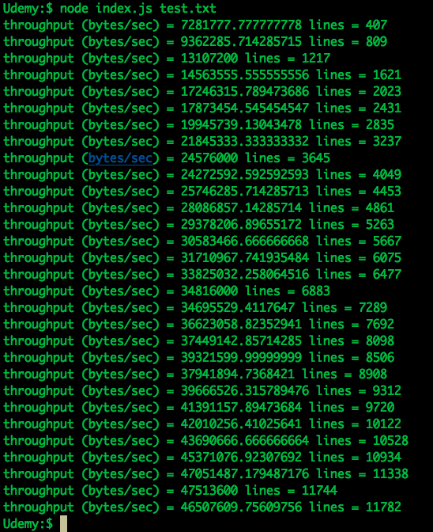

## Zillow Coding Assignment

### Question 
- Try to avoid using third party modules
- Stick to node.js core APIs
- Write a test to confirm your module works correctly

Create a duplex stream that outputs summary objects with keys for the
elapsed time, total length in bytes, and total lines.
Create a stream that takes the summary objects and outputs
a oneline summary report suitable for logging. 
The report should include the throughput rate of the input stream in bytes/sec.
Use your new streams in a script designed to take text input (such as
from a log file) and report on the number of lines and growth rate of
the file. 
Bonus points if your script is configurable in some way via `argv` (use your imagination).
Imagine a usage like this:
```
$ tail -f mylogfile | myscript verbose
```

### Solution


### Command to start the program

```
$ node index.js <FileName>
```
Please try the following examples.

```
$ node index.js test.txt
```

```
$ node index.js testImage.jpg
```